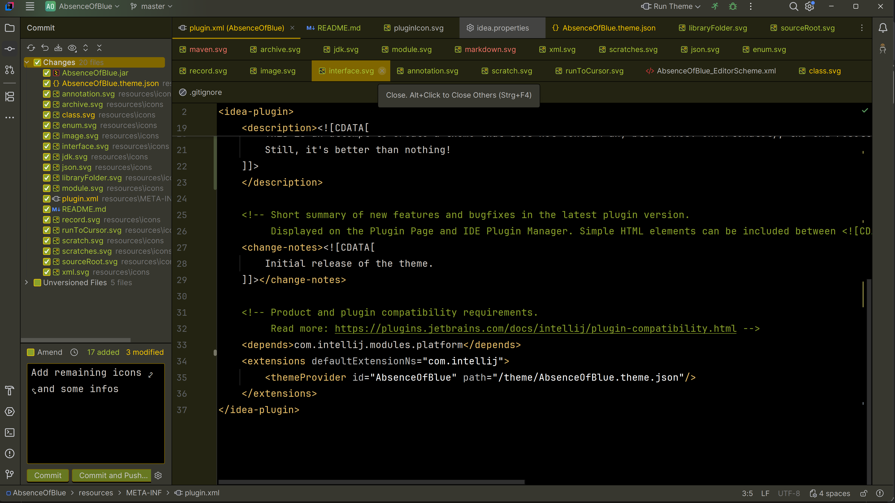
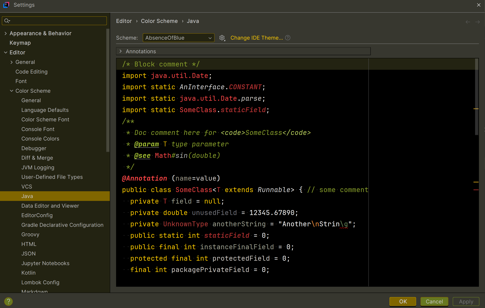

# Info
Decided to not publish this theme to JetBrains marketplace, since it's not complete.
Well, I wasn't able to reach the goal to exchange every blue tone in IDE and appropriate icons,
and I have not the time yet, to dig even deeper.

Finally, for me, developing mainly Java code it's quite OK so far, to have at least a lot fewer blue tones.
Exceptionally, I pushed the theme artifact JAR to this repo, mainly for myself to install the theme manually
per Settings -> Plugins -> Install Plugin from Disk...

This theme was created using IntelliJ IDEA version 2025.2.4.

# Screenshots

